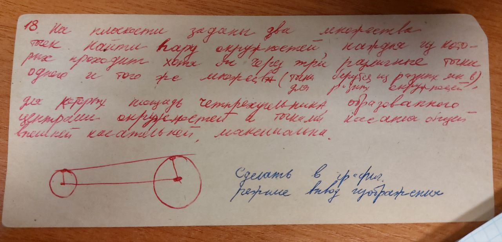

# Условие лабораторной работы №1

`Вариант №18`

На плоскости заданы два множества точек. Найти пару окружностей, каждая из которых проходит хотя бы через три различные точки одного и того же множества (точки берутся из разных множеств для разных окружностей), для которых площадь четырехугольника, образованного центрами окружностей и точками касания общей внешней касательной, максимальна.

