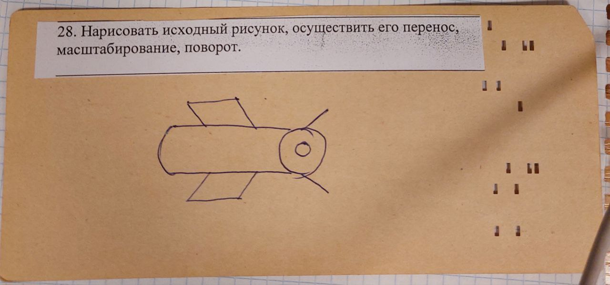

# Условие лабораторной работы №1

`Вариант №28`

Нарисовать исходный рисунок, осуществить его перенос, масштабирование, поворот.




# How to use

### Чтобы запустить программу, введите:
```bash
    cd ./lab_01_18
    python3 ./main.py
```
